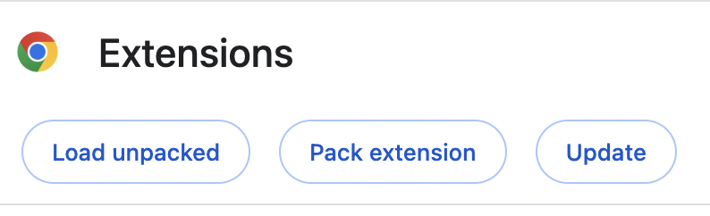
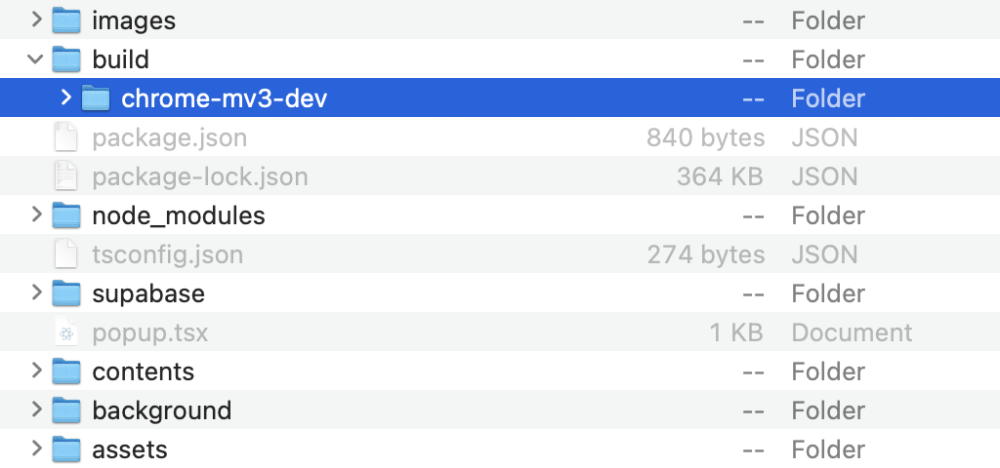

## Introduction
Ever wanted to quickly grasp the community's reaction to a YouTube video without wading through hundreds or thousands of comments? Pulse is here to revolutionize how we understand audience feedback. This powerful extension leverages the advanced capabilities of Google Gemini 1.5, with its vast 1 million context token window, to deliver comprehensive summaries of YouTube comments. Perfect for both video consumers and content creators, Pulse provides an accurate and nuanced summary, capturing the key sentiments and insights from even the largest comment sections.

### Check out our Dev Post!
https://devpost.com/software/pulse-2uy6zl

### Demonstration
https://www.youtube.com/watch?v=v-vYJBhWT1g&ab_channel=BalajiK

## Key Features

### For Content Creators:
- **Enhanced Engagement:** Understand the audience's reaction to fine-tune content strategy and increase viewer engagement.
- **Feedback Aggregation:** Get quick insights into what works and what doesn’t, directly from your viewer base.
- **Trend Detection:** Identify emerging trends and topics in viewer comments to stay ahead of the curve.
- **Community Sentiment Analysis:** Gauge the overall sentiment of the comments to better respond to audience mood and preferences.

### For Subscribers:
- **Time Saving:** Quickly grasp the gist of community discussions without scrolling through thousands of comments.
- **Enhanced Interaction:** Engage more effectively with content by understanding prevalent viewer opinions and questions.
- **Personalized Summaries:** Receive tailored summaries based on the most relevant themes in the comment section.

## How It Works
Pulse efficiently scans all comments on a YouTube video, utilizing the advanced natural language processing capabilities of Google Gemini 1.5. This technology enables Pulse to generate comprehensive summaries that encapsulate the core themes and sentiments of viewer discussions. With this tool, the need for repetitive summarization using small context windows and outdated algorithms is eliminated. Pulse delivers highly accurate, detailed summaries informed by every comment, providing a complete overview of viewer feedback in one go.

## Why It's Better

### Preservation of Nuance
One of the standout advantages of using Pulse is its ability to maintain the nuance in viewer comments, which is often lost in traditional summarization methods. Traditional approaches typically involve multiple rounds of summarization to handle large data sets, which can dilute the complexity and depth of the original comments. Each round of summarization risks stripping away layers of context and sentiment, potentially leading to a final summary that lacks the subtlety and richness of the original discussions.

Pulse, powered by Google Gemini 1.5, avoids these pitfalls by processing all comments in a single, expansive context window. This approach ensures that every nuance, whether a subtle shift in tone or a complex thematic element, is captured and reflected in the summary. By maintaining the integrity of the original comments, Pulse provides content creators and viewers with a deeper, more accurate understanding of the audience's reactions and sentiments.

### Efficiency and Accuracy
Furthermore, Pulse's single-pass summarization is not only more efficient but also more accurate. It reduces processing time and computational overhead, making it a practical tool for both content creators who need quick feedback and viewers who desire a quick grasp of the community's pulse. This efficiency does not compromise the quality of the output; instead, it enhances it by ensuring that the generated summaries are both comprehensive and timely, enabling users to react and adapt more swiftly to their audience's needs.

### Flexible and Cost-Effective Updates
Pulse offers flexible update schedules, allowing content creators to choose how frequently their video comments are summarized—from daily to weekly updates, depending on their preference. This flexibility helps in managing costs effectively, as each video is processed only as often as necessary. Once a video's comments are summarized, these summaries are stored and made available to subscribers extremely quickly, enhancing viewer engagement without redundant processing. Additionally, Pulse can asynchronously summarize comments across an entire video library, making it an ideal solution for creators with extensive content who wish to maintain engagement and understand viewer sentiment across all their videos. This asynchrony ensures that summaries are always up-to-date and ready when creators and viewers need them, providing a seamless and efficient user experience.


Pulse represents a significant advancement in comment analysis, offering a robust solution that meets the demands of today's dynamic and content-rich digital landscape.

## Subscription Model

### Content Creators:
Content creators can subscribe to Pulse to enable comment summaries for their videos, which can be showcased to viewers and used for personal content strategy development. Subscription options include additional features like real-time sentiment updates and detailed analytical reports.

### Subscribers:
Viewers can subscribe to receive advanced comment summaries, enabling a richer interaction with video content. Subscriptions also offer customization options, such as focusing summaries on specific aspects like questions or feedback.


Join the revolution in video comment analysis and never miss the pulse of your audience again!


## Getting Started

This is a [Plasmo extension](https://docs.plasmo.com/) project bootstrapped with [`plasmo init`](https://www.npmjs.com/package/plasmo).

First, clone this github repo to your local machine.

Once you've cloned the repo, run the development server where the repo is located.

```bash
pnpm dev
# or
npm run dev
```

Then open your browser and load the appropriate development build. Since this a Chrome extension, click on the 3 dots that indicate settings, then scroll to extensions. 


Click on "Manage Extensions".


Then click on load unpacked extensions. 


 
 
You will see the ability to load Pulse there. Navigate to your pulse repository on your computer, then select this folder to upload.



Afterwards, just click on the extension when on a youtube video and wait for the analysis (or get it immediately if it's a previously seen video). 


